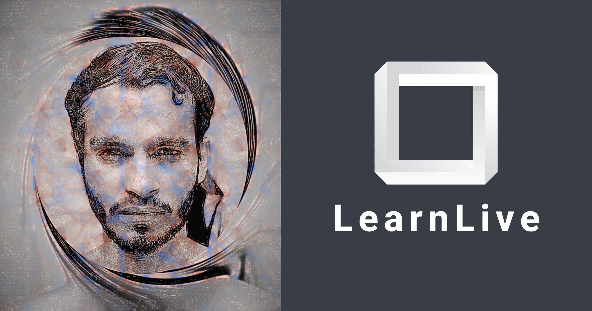

Hi there 👋  
🌱 I’m currently learning MERN Stack and have developed clone of major web applications like Facebook, Amazon, WhatsApp, Discord, COVID-19 Tracker available in my repositories  
💬 Ask me about MERN Stack, Business Process Management, Java, Database 
📫 Reach out to me at nitish.corporate94@gmail.com 
💼 See my full portfolio at https://nitish-profile.netlify.app/ 
 
<a href="https://www.youtube.com/channel/UCn1z0wb7dhFTnw_rrMrdaYw/videos">LearnLive - YouTube Channel</a>
