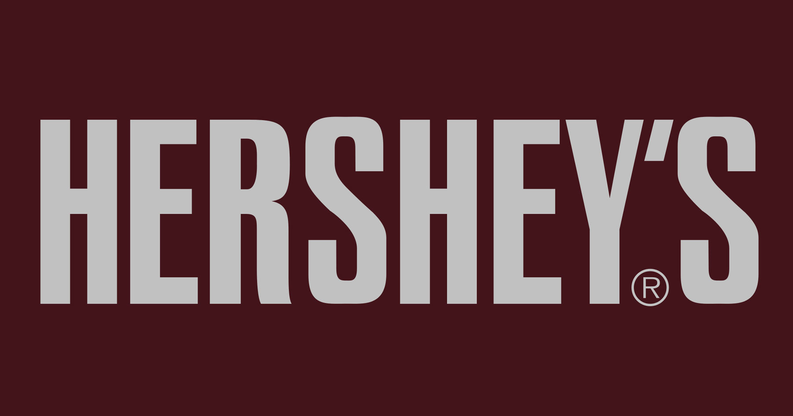
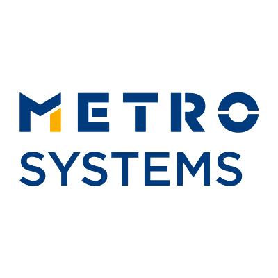
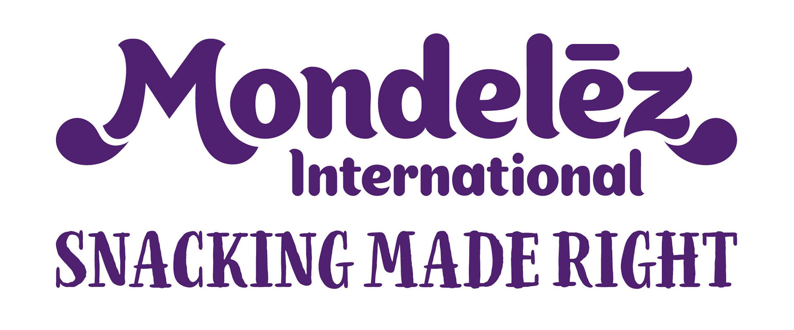

Hi there 👋  
## Who Am I ? 👨
Versatile Senior Software Developer with more than 4 years of experience in production-level projects and interacting with international clients - The Hershey, Metro Systems, Mondelez International, and Verizon. A self-directed leader with talent at cultivating a collaborative and supportive team environment. I enjoy being challenged and engaged with projects that require me to work beyond my comfort and knowledge set, as I get to explore and learn new languages with different development techniques which are important for growth of any professional like me as well as the success of any organisation.   
🌱 I’m currently learning MERN Stack and have developed clone of major web applications: 
 &nbsp; &nbsp; &nbsp;Facebook 
 &nbsp; &nbsp; &nbsp;Amazon 
 &nbsp; &nbsp; &nbsp;WhatsApp 
 &nbsp; &nbsp; &nbsp;Discord 
 &nbsp; &nbsp; &nbsp;COVID-19 Tracker available in my repositories  
💬 Ask me about MERN Stack, Business Process Management, Java, Database, SAP 
📫 Reach out to me at nitish.corporate94@gmail.com 
## Find Me Around The Web 🌎
💼 See My Full Portfolio at https://nitish-profile.netlify.app/ 
📄 Personal Blogs at https://learnwithnitish.wordpress.com/  
 
<a href="https://www.youtube.com/channel/UCn1z0wb7dhFTnw_rrMrdaYw/videos">LearnLive - YouTube Channel</a>

## Clients Worked With 👥

